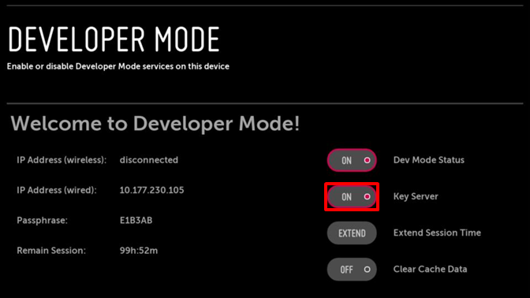

# Remote TV control for developers

Tools for Smart TV developers.


## Supported platforms

- Samsung Tizen
- LG WebOS
- PlayStation4 DevKit/TestKit
- Samsung Orsay 2014+

## Usage

### Run RTV in Docker

The easiest way to run RTV is to run it in Docker container. It contains [Samsung Tizen CLI](https://developer.samsung.com/smarttv/develop/getting-started/using-sdk/command-line-interface.html) and [LG webOS CLI](https://webostv.developer.lge.com/sdk/installation/download-installer/).

On Linux:

```bash
   docker run -it \
      -e USER=rtv \
      -e WEBOS_ACCOUNT_LOGIN={your_login} \
      -e WEBOS_ACCOUNT_PASSWORD={your_password} \
      --network=host \
      -v tvdata:/home/developer \
      kinopoisk/rtv
```

On MacOS:

```bash
   docker run -it \
      -e USER=rtv \
      -e WEBOS_ACCOUNT_LOGIN={your_login} \
      -e WEBOS_ACCOUNT_PASSWORD={your_password} \
      -p=3000:3000 \
      -v tvdata:/home/developer \
      kinopoisk/rtv
```

Note: NETWORK_MODE=host allows to scan and wake on LAN TVs, but doesn't work on MacOS.

Note: `WEBOS_ACCOUNT_LOGIN` and `WEBOS_ACCOUNT_PASSWORD` are required only for WebOS TVs.
They should be created [here](https://us.lgaccount.com/) and are used for login in WebOS Developer Mode application.

### Setup without Docker

1. Install and configure [rtv-server](packages/server/README.md)
2.
3. Install and configure [rtv-cli](packages/cli/README.md)
4. For programmatic usage with Node.JS or Browser JS please install [rtv-client](packages/client/README.md)

## Development

### Development without Docker

1. Install necessary SDK:

   - [Samsung Tizen CLI](https://developer.samsung.com/smarttv/develop/getting-started/using-sdk/command-line-interface.html)
   - [LG webOS CLI](https://webostv.developer.lge.com/sdk/installation/download-installer/)

2. `nvm use` - use needed version of Node.JS via [Node Version Manager](https://github.com/nvm-sh/nvm)
3. Install dependencies:
   `npm install`
   `npm run bootstrap`
4. `npm run dev` - builds packages and runs server in watch mode

#### Development in Docker

1. Install [docker-compose](https://docs.docker.com/compose/install/)
2. Build image: `npm run docker:build`
3. Run docker container: `npm run docker:up`
4. Open RTV UI locally: http://localhost:3000

## Release

Releases goes separately to npm and docker registry.
Try keep them in sync.

#### Release to npm

1. Run tests: `npm t`
2. Bump version: `npm run release-minor` | `npm run release-patch`
3. Publish to npm: `npm run publish`
4. Push to GitHub: `git push`

#### Release Docker image

1. Build image: `npm run docker:build`
2. Run tests in container: `npm run docker:test`
3. Tag image: `docker tag rtv:latest kinopoisk/rtv:latest`
4. Push image to registry: `IMAGE=kinopoisk/rtv:latest npm run docker:push`

## Adding new TV
It is necessary that the working computer and the TV are on the same local network.

#### Adding and configuring Tizen (Samsung)

1. In RTV UI settings ({YOUR_RTV_SERVER}/settings/tv) manually add a TV (by `New TV` button).
   Specify `IP`, `alias` and `platform` and save. For instance:

    ```
      IP = 192.168.1.66 (on the TV Settings -> General -> Network -> Network Status -> IP Settings)
      alias = tizentv (or whatever)
      platform = tizen
    ```

2. Specify `Developer IP` on the TV:
    - open `Apps` (application `Applications` on the TV)
    - press the buttons on the `12345` remote control in turn until the input window appears (it may not work the first time)
    - in the window that appears, enable `Developer mode`, if it is not enabled yet, and enter the ip address of your rtv-server as Developer IP
    - reboot the TV (long press the power button on the remote)

#### Adding and configuring Webos (LG)

1. In RTV UI settings ({YOUR_RTV_SERVER}/settings/tv) manually add your TVs (the `New TV` button).
    Specify `IP`, `alias` and `platform` and save. For instance:
    ```
      IP = 192.168.1.12 (on the TV usually `Settings` -> `Connection` -> `Network` -> `Wired connection (or Wi-Fi connection)` -> `Advanced settings`)
      alias = webostv (or whatever)
      platform = webos
    ```
2. [Install Developer Mode App](https://webostv.developer.lge.com/develop/app-test/using-devmode-app/#installDevModeApp) on TV if not installed.
3. On the RTV UI main screen select the added TV from the drop-down list and press the `Dev Mode` button if an LG account was specified when starting RTV, or log in manually.
4. Enable `Key Server` in Developer Mode:

   

5. In the settings ({YOUR_RTV_SERVER}/settings/tv) on the TV, add the `Passphrase` field from the TV screen.

#### Adding and configuring Orsay 2014+ (Legacy Samsung)
1. In RTV UI settings ({YOUR_RTV_SERVER}/settings/tv) manually add a TV set (the `New TV` button).
   Specify `IP`, `alias` and `platform` and save. For instance:

    ```
      IP = 192.168.37.1 (on the TV Settings -> Network -> Network Status -> IP Settings)
      alias = orsaytv (or whatever)
      platform = orsay
    ```

2. Specify `Developer IP` on the TV:
    - open `Menu`->`Smart Hub`->`Samsung Account`->`Login`->`Login`
    - In the applications menu (Samsung Apps), long press on any application, select `IP Settings`, and enter the IP address of your working computer as Developer IP

#### Adding and configuring PlayStation4 DevKit/TestKit
   In RTV UI settings ({YOUR_RTV_SERVER}/settings/tv) manually add a PlayStation (by `New TV` button).
   Specify `IP`, `alias` and `platform` and save. For instance:

    ```
      IP = 192.168.1.66
      alias = ps (or whatever)
      platform = playstation
    ```

#### Adding and running the application
1. In RTV UI settings ({YOUR_RTV_SERVER}/settings/tv) add your application (the `New App` button):

    ```
    alias=app (or whatever)
    Tizen ID = {TIZEN_ID} if exists
    Webos ID = {WEBOS_ID} if exists
    Orsay ID = {ORSAY_ID} if exists
    PS ID = {PLAYSTATION_ID} if exists
    ```

2. Install the package on the TV. For now, the easiest way to do this is through RTV UI:
    - select the desired TV in the drop-down list
    - click the `Install` button below and specify the path to the package.

    For Orsay, the installer uploads the package to the rtv-server. To download to TV, you need to additionally synchronize uploaded applications: in the application menu (Samsung Apps), you need to call the context menu on any application and click `Start User App Sync`. Dev mode must be running for this item to be available.

    If when running on Webos there is an error like "ares-install ERR! ares-install: Error: All configured authentication methods failed",
    then you need to re-request the ssh key from the TV set with the `Key Server` enabled in the Develper Mode application. To do this, enable the key server and change the passphrase in RTV UI settings ({YOUR_RTV_SERVER}/settings/tv) to the wrong one, then back to the correct one.

3. Application launch:
    - via `Launch` or `Debug` button in RTV UI. You can pass launch params also. You should process theese params on your application side.
